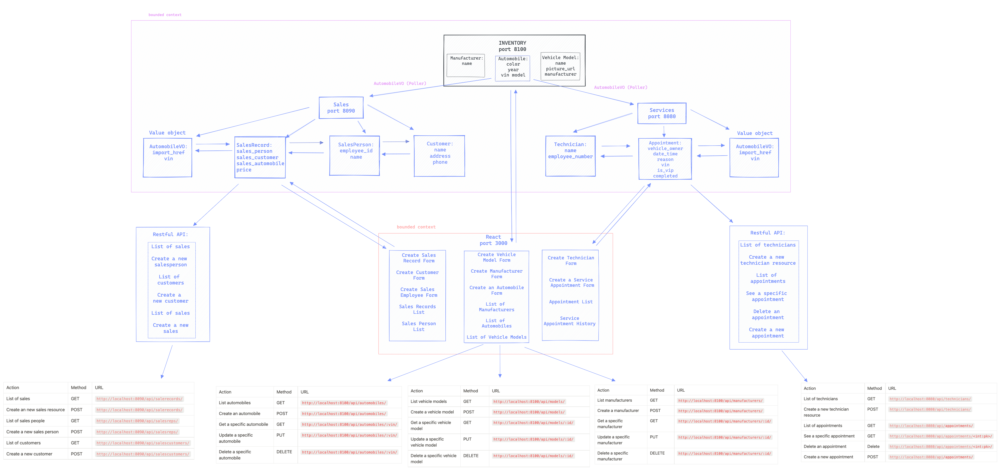

# CarCar

Team:

* Caleb Lee - Service Microservice
* Mandy Liou - Sales Microservice

## Design

## Instructions to run application
1. Fork the project from the respective gitlab repository
2. Open terminal and cd into desired folder to host the project
    - git clone <<repository link>>
    - cd <<project name>>
3. Run the following command to open the application in Visual Studio Code
    - code .
4. Run the following commands after opening the project in the desired folder:
    - docker volume create beta-data (generates database)
    - docker-compose build (creates the images for the containers)
    - docker-compose up (creates containers and runs them with the respective images)
5. View the application on http://localhost:3000

## PORTS and URL Paths
INVENTORY MICROSERVICE (Manufacturers, vehicle models, and automobiles):
--------------------------------------------------------------------------------------------
MANUFACTURERS

| Method | URL | Expected Response | PORT

| GET | http://localhost:8100/api/manufacturers/ | List manufacturers | 8100

| POST | http://localhost:8100/api/manufacturers/ | Create a manufacturer |  8100

| GET | http://localhost:8100/api/manufacturers/:id/ | Get a specific manufacturer |8100

| PUT | http://localhost:8100/api/manufacturers/:id/ | Update a specific manufacturer | 8100

| DELETE | http://localhost:8100/api/manufacturers/:id/  | Delete a specific manufacturer | 8100

--------------------------------------------------------------------------------------------
VEHICLE MODELS

| Method | URL | Expected Response | PORT

| GET | http://localhost:8100/api/models/ | List vehicle models | 8100

| POST | http://localhost:8100/api/models/ |Create a vehicle model | 8100

| GET | http://localhost:8100/api/models/:id/ | Get a specific vehicle model | 8100

| PUT | http://localhost:8100/api/models/:id/ |Update a specific vehicle model | 8100

| DELETE | http://localhost:8100/api/models/:id/ | Delete a specific vehicle model | 8100

--------------------------------------------------------------------------------------------
AUTOMOBILES

| Method | URL | Expected Response | PORT

| GET | http://localhost:8100/api/automobiles/ | List automobiles | 8100

| POST | http://localhost:8100/api/automobiles/ | Create an automobile | 8100

| GET | http://localhost:8100/api/automobiles/:vin/ | Get a specific automobile | 8100

| PUT | http://localhost:8100/api/automobiles/:vin/ | Update a specific automobile | 8100

| DELETE | http://localhost:8100/api/automobiles/:vin/ | Delete a specific automobile | 8100

--------------------------------------------------------------------------------------------
SALES MICROSERVICE

| Method | URL | Expected Response | PORT

| GET | http://localhost:8090/api/salerecords/ | List of sales | 8090

| POST | http://localhost:8090/api/salerecords/ | Create an new sales record | 8090

| GET | http://localhost:8090/api/salesreps/ | List of sales people | 8090

| POST | http://localhost:8090/api/salesreps/ | Create a new sales person | 8090

| GET | http://localhost:8090/api/salescustomers/ | List of customers | 8090

| POST | http://localhost:8090/api/salescustomers/ | Create a new customer | 8090

--------------------------------------------------------------------------------------------
SERVICE MICROSERVICE

| Method | URL | Expected Response | PORT

| GET | http://localhost:8080/api/technicians/ | List of technicians | 8080

| POST | http://localhost:8080/api/technicians/ | Create a new technician resource | 8080

| GET | http://localhost:8080/api/appointments/ | List of appointments | 8080

| GET | http://localhost:8080/api/appointments/<int:pk>/ | See specific appointment | 8080

| POST | http://localhost:8080/api/appointments/ | Create a new appointment | 8080

--------------------------------------------------------------------------------------------

## Service microservice

AutomobileVO: AutomobileVO is a value object with respect to the Automobile model which is located in the inventory microservice. The purpose of this model is to relate the vin information to the specific service appointment and determine whether the automobile came from the inventory microservice, which would cause the appointment service to be considered VIP. This relation is made possible through the construction of a ForeignKey in tandem with the poller, which serves to pull the automobile vin from the inventory api and into the services microservice.

Appointment: The appointment model serves as an entity in which specific values within its value objects can be attributed to the model.

Technician: The technician model serves as an entity in which specific values within its value objects can be attributed to the model. It also serves as a foreign key within the appointment model, as it is possible to assign particular technician to a specific appointment.

## Sales microservice

Explain your models and integration with the inventory
microservice, here.

AutomobileVO: AutomobileVO is a value object with respect to the Automobile model, which is located in the inventory microservice. The purpose of this model is to relate the automobile information to the specific sales record, customer, and sales person. This information will ultimately be reflected in the Sales record model, where all other models are contingent on the AutomobileVO model. This relation is made possible through the construction of a ForeignKey in tandem with the poller, which serves to pull the automobile vin and import_href from the inventory api and into the sales microservice.

Customer: The customer model serves as an entity in which specific values within its value objects can be attributed to the model. The customer exists as a foreign key in the sales record. This model has attributes of name, address, and phone number of the customer.

SalesPerson: The salesperson model serves as an entity in which specific values within its value objects can be attributed to the model. The salesperson exists as a foregin key in the sales record. This model has attributes of the sales employee with attributes such as the employee_id and employee's name.

SalesRecord: The SalesRecord model serves as an entity in which the other models exists in the salesrecord values as foreign keys. Their relations are made possible by the existence of the automobile value object, which was derived from the inventory microservices. This model has attributes of the sales record for each employee(sales_person), along with attributes such as the customer(sales_customer), automobile(sales_automobile), and price.

As shown in the diagram, the Sales microservice is on port 8090 and url is http://localhost:8090.
